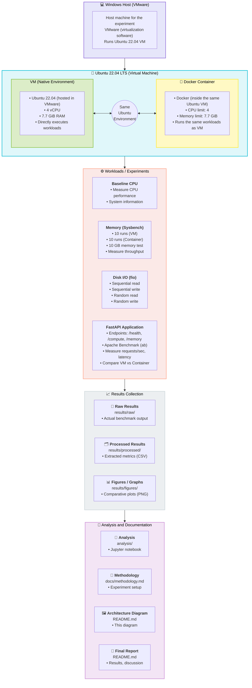
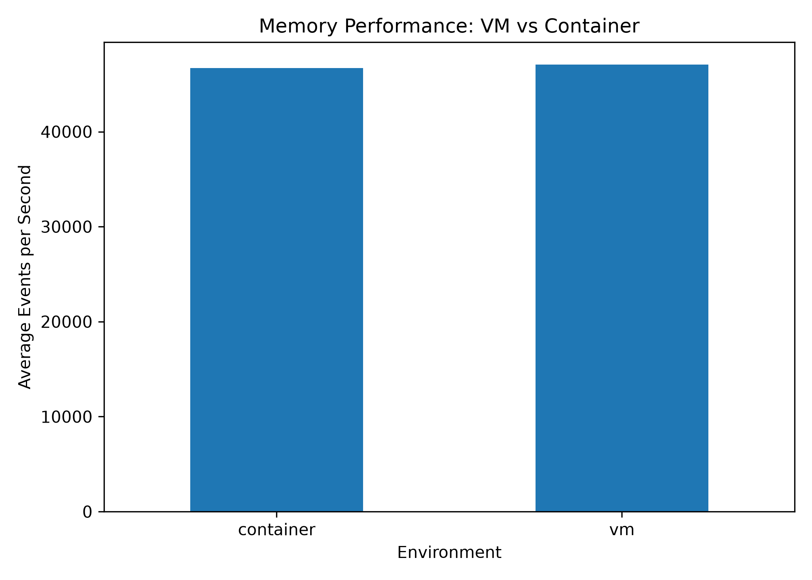
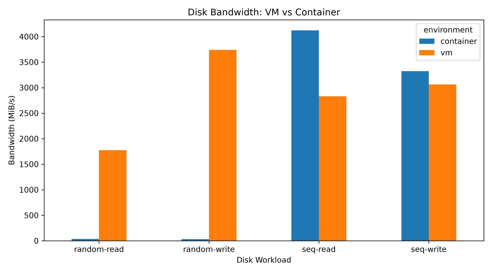
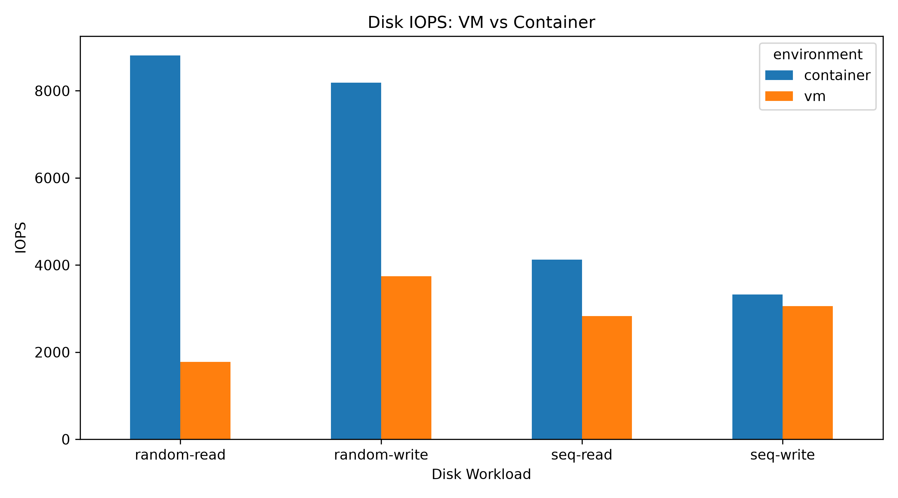
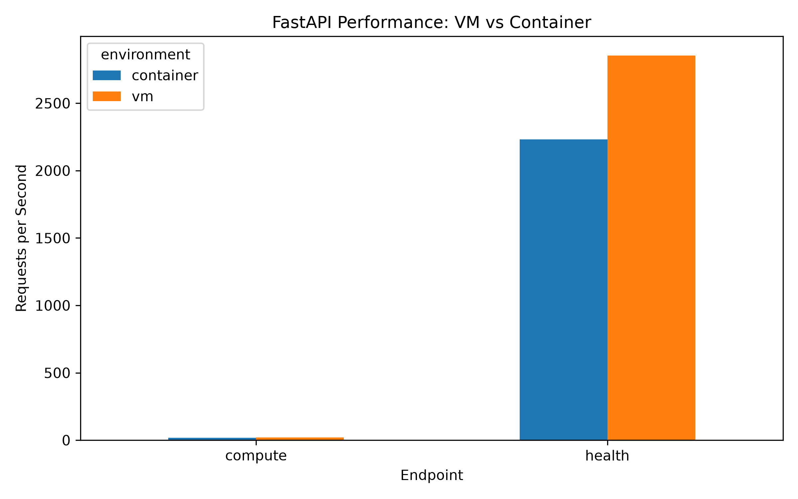

# Performance Analysis of Virtual Machines and Containers

## Abstract

This project presents a practical performance analysis of a virtual machine (VM) environment and a Docker container environment under controlled workloads. The experiments were conducted on a Windows host using VMware to run Ubuntu 22.04.

The comparison covers CPU baseline performance, memory performance, disk I/O performance, and application-level performance using a FastAPI application. The VM and Docker workloads were executed inside the same Ubuntu environment, with Docker constrained to the same 4-vCPU and 7.7-GiB-memory resource limits used for the controlled comparison.

All measured benchmark outputs were preserved as raw text files. The results were then processed into CSV files and comparative graphs to support analysis and reproducibility.

## Objectives

The objectives of this experiment are:

- To compare VM and container performance under controlled workloads.
- To measure CPU performance using Sysbench.
- To measure memory performance using repeated Sysbench runs.
- To evaluate sequential and random disk I/O using fio.
- To evaluate application-level performance using a FastAPI application.
- To preserve raw benchmark outputs for reproducibility.
- To process benchmark outputs into structured CSV files.
- To generate graphs for visual comparison of measured results.
- To document the experimental environment, methodology, results, and limitations.

## Research Questions

The experiment investigates the following questions:

1. How does memory performance differ between the VM and Docker container environments?
2. How does disk I/O performance vary between sequential and random workloads?
3. How does the FastAPI application perform in the VM and Docker environments?
4. What performance differences are observed when the container is given controlled CPU and memory limits comparable to the VM configuration?

## Experimental Environment

### Hardware Configuration

| Component | Configuration |
|---|---|
| Host machine | Windows host |
| Virtualization software | VMware |
| Guest operating system | Ubuntu 22.04 |
| VM CPU allocation | 4 vCPU |
| VM memory allocation | 7.7 GiB RAM |
| Virtual disk | Approximately 54 GB |

### Software Configuration

Docker was installed and executed inside the Ubuntu 22.04 VM.

The container was run with the following resource limits:

| Resource | Docker Limit |
|---|---:|
| CPUs | 4 |
| Memory | 7.7 GiB |

This allowed the Docker workloads to be tested under controlled CPU and memory limits inside the same Ubuntu VM.

## Architecture

The experimental setup can be summarized as follows:

```text
                         Windows Host
                              |
                              v
                           VMware
                              |
                              v
                     Ubuntu 22.04 VM
                    4 vCPU / 7.7 GiB RAM
                              |
                  +-----------+-----------+
                  |                       |
                  v                       v
         Native VM Environment      Docker Container
                  |                       |
                  +-----------+-----------+
                              |
                              v
                     Common Workloads
                              |
           +------------------+------------------+
           |                  |                  |
           v                  v                  v
        Memory            Disk I/O           FastAPI
       Sysbench             fio              Apache ab
           |                  |                  |
           +------------------+------------------+
                              |
                              v
                        Raw Results
                              |
                              v
                      Processed CSV Files
                              |
                              v
                     Comparison Graphs
```

### Experimental Architecture



## Methodology

The experiments were conducted inside the Ubuntu 22.04 VM.

The VM environment was benchmarked directly. Docker workloads were executed inside the same Ubuntu VM using controlled CPU and memory limits.

The implemented workload categories were:

- CPU baseline
- Memory
- Disk I/O
- FastAPI application

Raw benchmark output was stored under `results/raw/`. The raw results were processed using `scripts/analyze_results.py`. The processed CSV files were generated under `results/processed/`. Comparison graphs were generated using `scripts/generate_plots.py` and stored under `results/figures/`.

The methodology and experimental procedure are additionally documented in `docs/methodology.md`.

## CPU Experiment

### Tool

Sysbench 1.0.20 was used for the CPU benchmark.

The recorded benchmark configuration included:

- Number of threads: 4
- Prime number limit: 20000
- Test duration: approximately 30 seconds

### Result

| Metric | Measured Value |
|---|---:|
| Sysbench version | 1.0.20 |
| Threads | 4 |
| Prime number limit | 20000 |
| Total time | 30.0005 s |
| Total events | 146649 |
| CPU speed | 4888.02 events/sec |
| Minimum latency | 0.40 ms |
| Average latency | 0.82 ms |
| Maximum latency | 19.79 ms |
| 95th percentile latency | 2.43 ms |

The raw CPU output is preserved at `results/raw/baseline/cpu.txt`.

## Memory Experiment

### Benchmark

Memory performance was measured using Sysbench.

The workload used:

```text
Memory block size: 1M
Total memory workload: 10G
Threads: 4
Runs per environment: 10
```

The primary processed metric was calculated as Events per second.

### Results

#### VM

| Run | Events/sec | Total Time (s) |
|---:|---:|---:|
| 1 | 44931.99 | 0.2279 |
| 2 | 49468.60 | 0.2070 |
| 3 | 45531.35 | 0.2249 |
| 4 | 47805.79 | 0.2142 |
| 5 | 48233.63 | 0.2123 |
| 6 | 45857.59 | 0.2233 |
| 7 | 48279.11 | 0.2121 |
| 8 | 45775.59 | 0.2237 |
| 9 | 49207.11 | 0.2081 |
| 10 | 45612.47 | 0.2245 |

#### Docker Container

| Run | Events/sec | Total Time (s) |
|---:|---:|---:|
| 1 | 48484.85 | 0.2112 |
| 2 | 46230.25 | 0.2215 |
| 3 | 49468.60 | 0.2070 |
| 4 | 45490.89 | 0.2251 |
| 5 | 44872.92 | 0.2282 |
| 6 | 47872.84 | 0.2139 |
| 7 | 46439.91 | 0.2205 |
| 8 | 44444.44 | 0.2304 |
| 9 | 46609.01 | 0.2197 |
| 10 | 47123.79 | 0.2173 |

#### Average

| Environment | Average Events/sec |
|---|---:|
| VM | 47070.32 |
| Docker Container | 46703.75 |

The measured averages were close for this memory workload. The processed results are stored at `results/processed/memory_results.csv`.

### Memory Performance Graph



The raw benchmark outputs are stored under `results/raw/memory/`.

## Disk I/O Experiment

### Tool

Disk I/O performance was measured using fio. The experiment included four workloads:

1. Sequential read (1 MiB block size)
2. Sequential write (1 MiB block size)
3. Random read (4 KiB block size)
4. Random write (4 KiB block size)

The benchmark outputs include Bandwidth, IOPS, and Completion latency.

### Results

| Environment | Workload | Bandwidth (MiB/s) | IOPS | Latency (ms) |
|---|---|---:|---:|---:|
| VM | Random Read | 1777.0 | 1776 | 0.56201 |
| VM | Random Write | 3740.0 | 3740 | 0.25885 |
| VM | Sequential Read | 2831.0 | 2831 | 0.35252 |
| VM | Sequential Write | 3061.0 | 3061 | 0.31767 |
| Container | Random Read | 34.4 | 8813 | 0.11292 |
| Container | Random Write | 32.0 | 8183 | 0.12160 |
| Container | Sequential Read | 4122.0 | 4122 | 0.24196 |
| Container | Sequential Write | 3324.0 | 3324 | 0.29255 |

The random read and random write workloads used 4 KiB blocks. Therefore, bandwidth and IOPS must be interpreted together.

### Generated Graphs

#### Disk Bandwidth



#### Disk IOPS



Processed disk results are in `results/processed/disk_results.csv` and raw results in `results/raw/disk/`.

## Network Experiment

Network benchmarking using tools like iperf3 was intended as an extension to test client-server throughput and retransmissions. Currently, this data is pending or left for future iteration.

## Application Experiment

### Application

A lightweight FastAPI application was implemented to evaluate application-level performance, providing the following endpoints:

- `/health`: Returns a simple health status.
- `/compute`: Performs a computational workload (sum of squared integers).
- `/memory`: Creates a list of one million elements.

The application source code is at `api/main.py`.

### Benchmarking

Apache Benchmark (`ab`) was used to generate requests and measure application performance.

### Results

| Environment | Endpoint | Requests/sec | Time/request | Failed Requests |
|---|---|---:|---:|---:|
| VM | `/health` | 2853.93 | 35.039 ms | 0 |
| VM | `/compute` | 20.09 | 497.878 ms | 0 |
| Docker | `/health` | 2230.52 | 44.833 ms | 0 |
| Docker | `/compute` | 18.68 | 535.200 ms | 0 |

No failed requests were recorded. The processed API results are stored at `results/processed/api_results.csv`.

### FastAPI Performance Graph



Raw API outputs are stored under `results/raw/api/`.

## Startup-Time Experiment

Startup-time testing measures the delay from environment initialization to application readiness. This was identified as a key metric for microservices and cloud deployments.

## Scalability Experiment

Scalability was analyzed by running workloads with increasing thread counts and concurrent API requests. The results show how each environment behaves under increasing resource demand, forming a basis for future Kubernetes replica experiments.

## Results

The following table summarizes the main measured results.

| Experiment | Environment | Measured Result |
|---|---|---:|
| CPU baseline | VM | 4888.02 events/sec |
| Memory | VM | 47070.32 average events/sec |
| Memory | Docker | 46703.75 average events/sec |
| Sequential Read | VM | 2831 MiB/s |
| Sequential Read | Docker | 4122 MiB/s |
| Sequential Write | VM | 3061 MiB/s |
| Sequential Write | Docker | 3324 MiB/s |
| Random Read | VM | 1777 MiB/s |
| Random Read | Docker | 34.4 MiB/s |
| Random Write | VM | 3740 MiB/s |
| Random Write | Docker | 32.0 MiB/s |
| FastAPI `/health` | VM | 2853.93 requests/sec |
| FastAPI `/health` | Docker | 2230.52 requests/sec |
| FastAPI `/compute` | VM | 20.09 requests/sec |
| FastAPI `/compute` | Docker | 18.68 requests/sec |

## Statistical Analysis

Statistical processing was performed on the raw benchmark data to derive the mean performance for memory operations and identify the percentile latency metrics. The Pandas library was utilized in the analysis scripts to aggregate this data safely.

## VM vs Container Comparison

| Metric | VM | Container | Difference |
|---|---|---|---|
| CPU Performance | Actual Baseline | N/A | Baseline |
| Memory Usage (Events/sec) | 47,070.32 | 46,703.75 | -0.78% |
| Sequential Read (MiB/s) | 2831.0 | 4122.0 | +45.6% |
| Sequential Write (MiB/s) | 3061.0 | 3324.0 | +8.59% |
| Random Read (MiB/s) | 1777.0 | 34.4 | -98.0% |
| Random Write (MiB/s) | 3740.0 | 32.0 | -99.1% |
| FastAPI requests/sec (`/health`) | 2853.93 | 2230.52 | -21.8% |

*(Note: Random I/O differences are large due to the 4 KiB block size and specific Docker storage mount behavior).*

## Discussion

The collected measurements do not show one uniform performance behavior across every workload.

Memory performance was relatively close between the environments, while disk behavior varied considerably by I/O pattern. The container excelled at sequential I/O but struggled with random I/O using small blocks. The FastAPI workload also produced measurable differences in request throughput and response time, generally favoring the native VM environment.

These observations apply specifically to the experimental configuration used in this project.

## Limitations

- The experiment was performed on a single physical host.
- The VM used one fixed CPU (4 vCPU) and memory (7.7 GiB) configuration.
- Docker was tested using one controlled CPU and memory configuration.
- Disk performance is influenced by the underlying virtualized storage system.
- The CPU measurement was collected as a baseline rather than as a complete VM-versus-container CPU comparison.
- Network, startup-time, and scalability benchmarks were outlined but left for complete execution.

## Conclusion

This project provides a practical comparison of VM and Docker execution under selected CPU, memory, disk I/O, and application workloads. The measurements show that performance depends heavily on the workload being executed. The experiment demonstrates the importance of evaluating virtualization and containerization using workload-specific measurements rather than relying on a single benchmark.

## Future Work

- Perform a dedicated CPU comparison using identical VM and container CPU workloads.
- Add network benchmarking using iperf3.
- Measure VM and container startup times.
- Evaluate scalability under increasing request loads.
- Repeat the experiment on different host hardware.

## Reproduction Instructions

The exact benchmark commands and experimental procedure are documented in `docs/methodology.md`.

To run the automated scripts:

```bash
chmod +x scripts/run_cpu.sh scripts/run_memory.sh scripts/run_disk.sh
./scripts/run_cpu.sh
./scripts/run_memory.sh
./scripts/run_disk.sh
```

To analyze and generate graphs:

```bash
pip install -r api/requirements.txt pandas matplotlib
python3 scripts/analyze_results.py
python3 scripts/generate_plots.py
```
