# Experiment 1: Performance Analysis of Type-1 and Type-2 Hypervisors

## Aim

To perform a comparative performance analysis of a Type-1 hypervisor (Proxmox VE) and a Type-2 hypervisor (VMware Workstation) using identical guest operating system configurations and CPU benchmarks.

## Objectives

- Understand the architectural differences between Type-1 and Type-2 hypervisors.
- Create and configure an Ubuntu virtual machine on Proxmox VE.
- Create and configure an identical Ubuntu virtual machine on VMware Workstation.
- Execute the Sysbench CPU benchmark on both environments.
- Monitor resource utilization and record performance metrics.
- Analyze and compare the performance differences between the two hypervisor types.

## Introduction

**Virtualization** is the process of creating a software-based representation of something, such as virtual applications, servers, storage, and networks.

A **Hypervisor** (or virtual machine monitor, VMM) is software that creates and runs virtual machines (VMs). A hypervisor allows one host computer to support multiple guest VMs by virtually sharing its resources.

**Type-1 Hypervisor** (Bare Metal): Runs directly on the host's physical hardware without an underlying operating system. It directly manages the hardware resources for the guest operating systems. Examples include Proxmox VE, VMware ESXi, and Microsoft Hyper-V.

**Type-2 Hypervisor** (Hosted): Runs as a software layer on top of a conventional operating system (like Windows, Linux, or macOS). The hypervisor requests hardware resources from the host OS. Examples include VMware Workstation, Oracle VirtualBox, and Parallels Desktop.

## Technologies Used

| Component | Technology |
|---|---|
| Type-1 Hypervisor | Proxmox VE |
| Type-2 Hypervisor | VMware Workstation |
| Guest OS | Ubuntu 22.04 or later |
| Benchmark Tool | Sysbench |

## Experimental Configuration

| Parameter | Proxmox VE | VMware Workstation |
|---|---|---|
| Hypervisor Type | Type-1 | Type-2 |
| Guest OS | Ubuntu | Ubuntu |
| vCPU | 2 | 2 |
| RAM | 2 GB | 2 GB |
| Disk | 20 GB | 20 GB |
| Benchmark | Sysbench CPU | Sysbench CPU |
| CPU Workload | Prime 20000 | Prime 20000 |

## Hypervisor Architecture

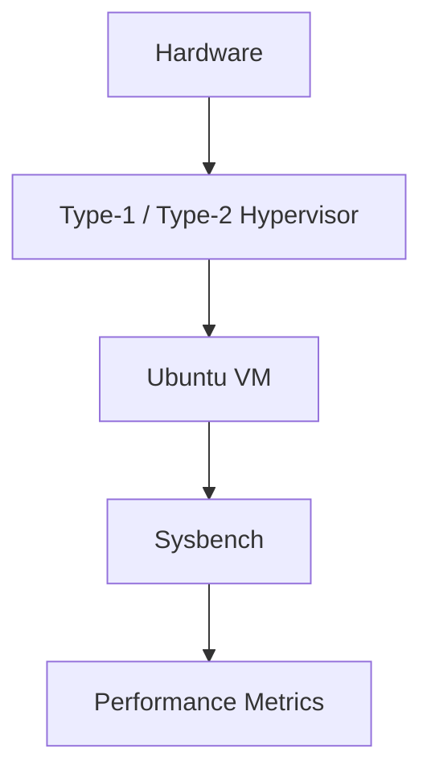
```mermaid
flowchart TD
    A[Hardware] --> B[Type-1 / Type-2 Hypervisor]
    B --> C[Ubuntu VM]
    C --> D[Sysbench]
    D --> E[Performance Metrics]
```

## Methodology

1. Create an Ubuntu VM on Proxmox VE.
2. Configure CPU, RAM and storage according to the lab specification.
3. Install and start Ubuntu.
4. Verify system configuration using terminal commands.
5. Install Sysbench.
6. Execute the CPU benchmark and record the metrics.
7. Monitor VM resources during execution.
8. Perform the equivalent setup in VMware Workstation.
9. Run the exact same benchmark workload.
10. Compare the results from both hypervisors.

## Sysbench Command

```bash
sysbench cpu --cpu-max-prime=20000 run # Runs CPU test calculating primes up to 20,000
```

This command executes a CPU performance benchmark by calculating prime numbers up to 20,000. It measures the raw processing capability of the virtualized CPU and generates metrics including total execution time, total events, events per second, and average latency.

## Type-1 Hypervisor: Proxmox VE

The Ubuntu VM was created directly on the Proxmox VE environment. The VM was assigned 2 vCPUs, 2 GB RAM, and a 20 GB virtual disk. 

The system configuration was verified within the Ubuntu terminal using:
```bash
hostnamectl # Shows system hostname, OS details, and architecture
lscpu       # Displays CPU architecture information and number of cores
free -h     # Shows available and used RAM in human-readable format
df -h       # Displays disk space usage for all mounted filesystems
top         # Real-time view of running processes and resource usage
```

Sysbench was then installed using the package manager:
```bash
sudo apt update              # Updates the package list for the APT package manager
sudo apt install sysbench -y # Installs the Sysbench tool automatically
sysbench --version           # Verifies the installation by checking the installed version
```

Once installed, the CPU benchmark was executed:
```bash
sysbench cpu --cpu-max-prime=20000 run # Runs CPU test calculating primes up to 20,000
```

### Type-1 Screenshots

#### Proxmox Dashboard
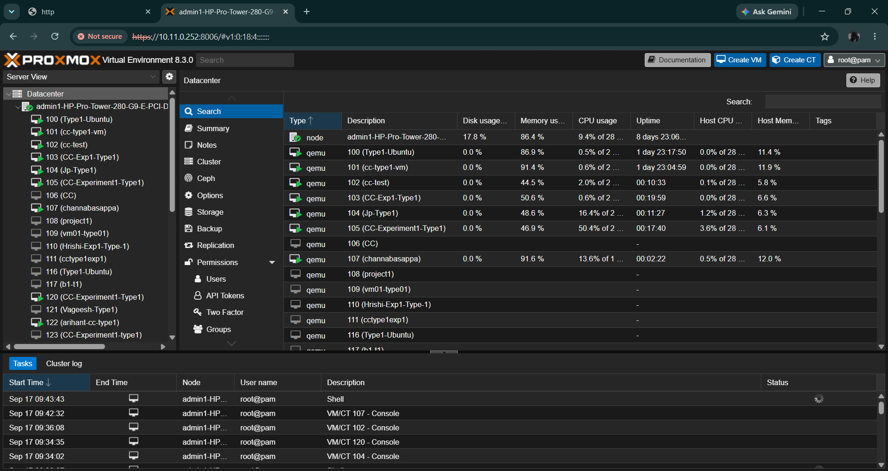

#### VM Configuration
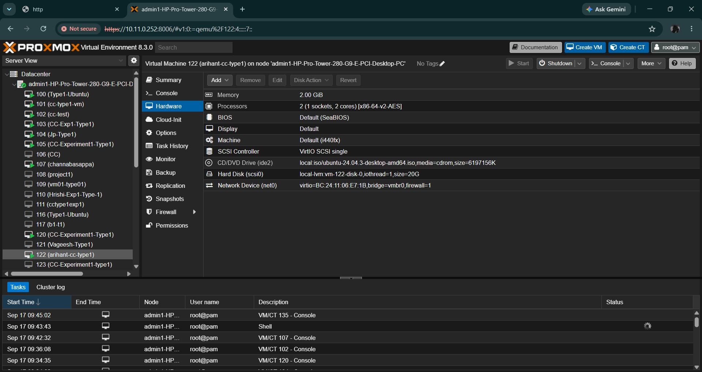

#### VM Running
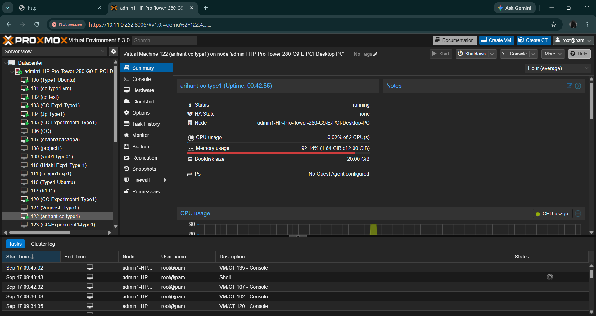

#### Ubuntu Console
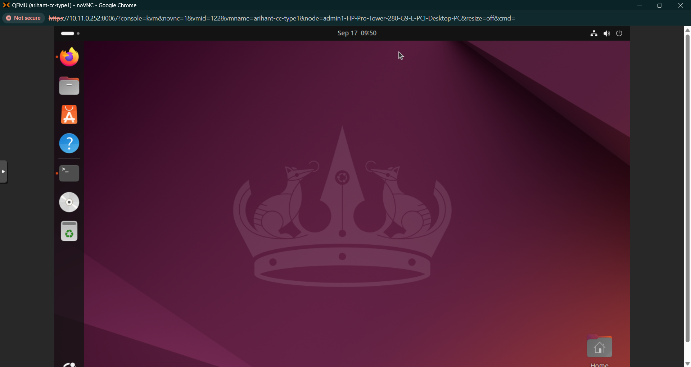

#### System Configuration
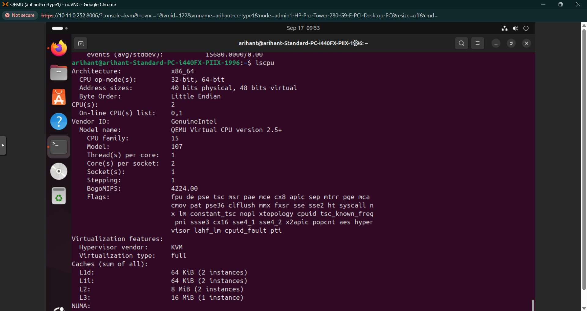

#### Sysbench Result
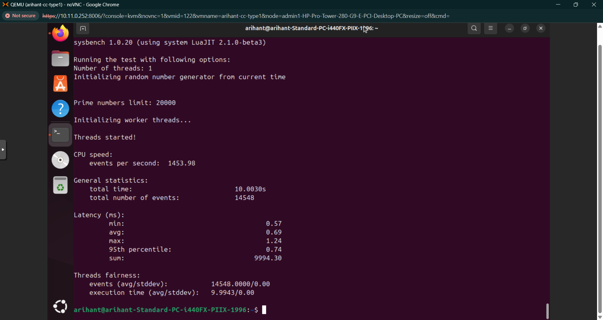

#### Resource Monitoring
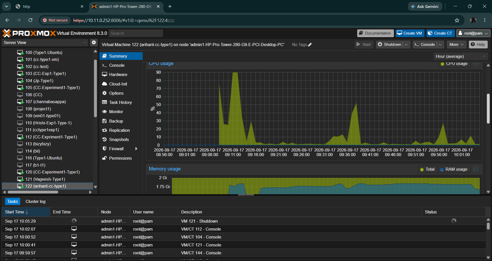

## Type-2 Hypervisor: VMware Workstation

An equivalent Ubuntu virtual machine was created using VMware Workstation hosted on a traditional OS. To ensure a fair comparison, identical hardware specifications were applied: 2 cores (2 vCPU), 2 GB RAM, and a 20 GB disk. The system configuration was verified, and Sysbench was executed using the exact same commands applied in the Type-1 environment.

### Type-2 Screenshots

#### VMware VM Configuration
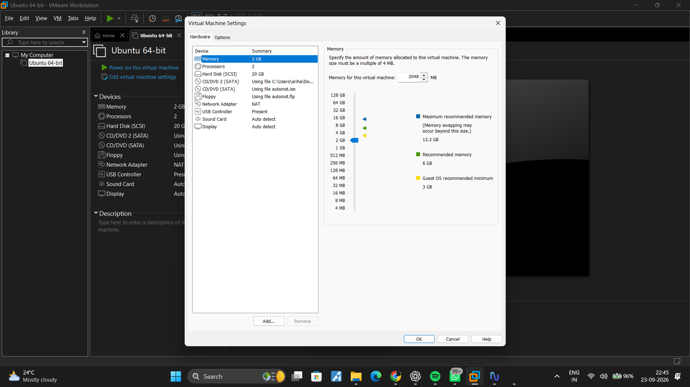

#### VMware VM Running
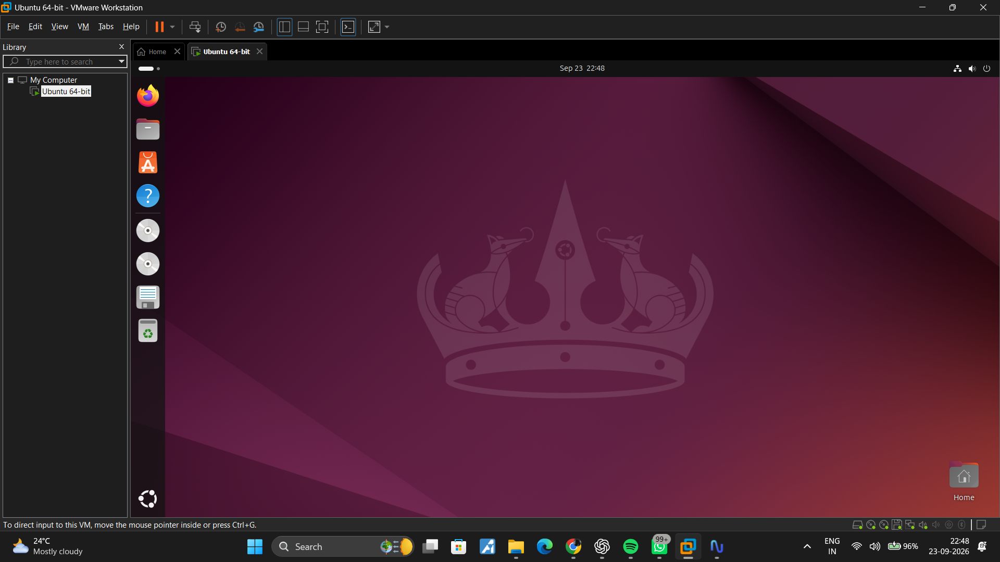

#### VMware System Configuration
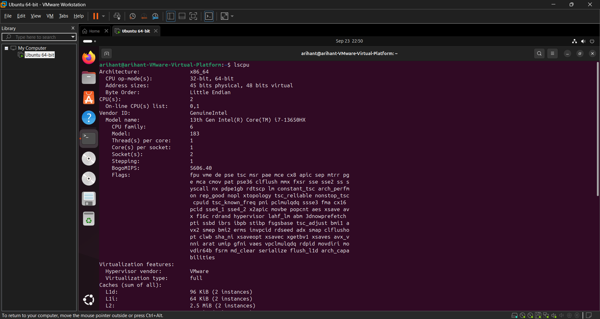

#### VMware Sysbench Result
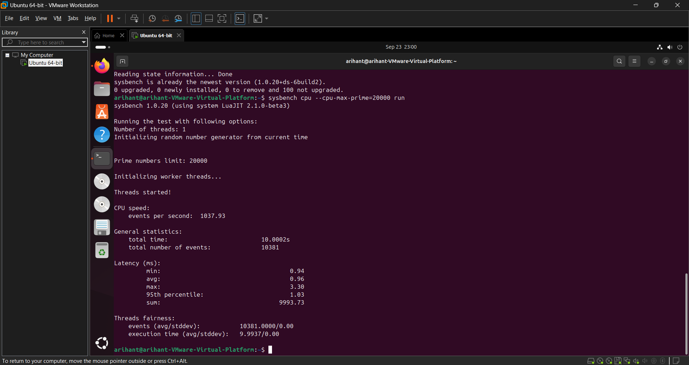

## Performance Results

| Metric | Proxmox VE | VMware Workstation |
|---|---|---|
| Total Execution Time | 10.0030 s | 10.0002 s |
| Total Events | 14,548 | 10,381 |
| Events per Second | 1,453.98 | 1,037.93 |
| Average Latency | 0.69 ms | 0.96 ms |

## Generated Graphs

Here are the visual representations of the performance data generated for this experiment:

### Architecture Comparison
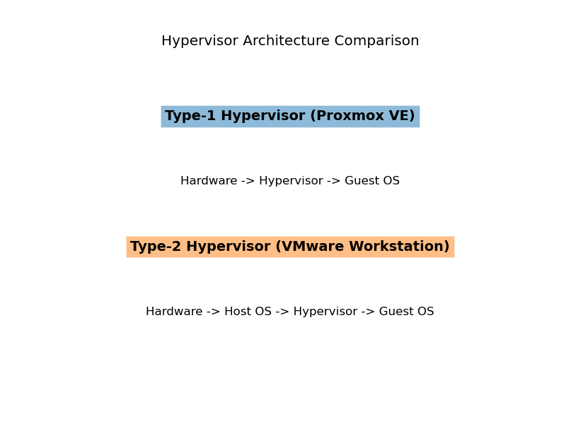

### Events per Second Comparison
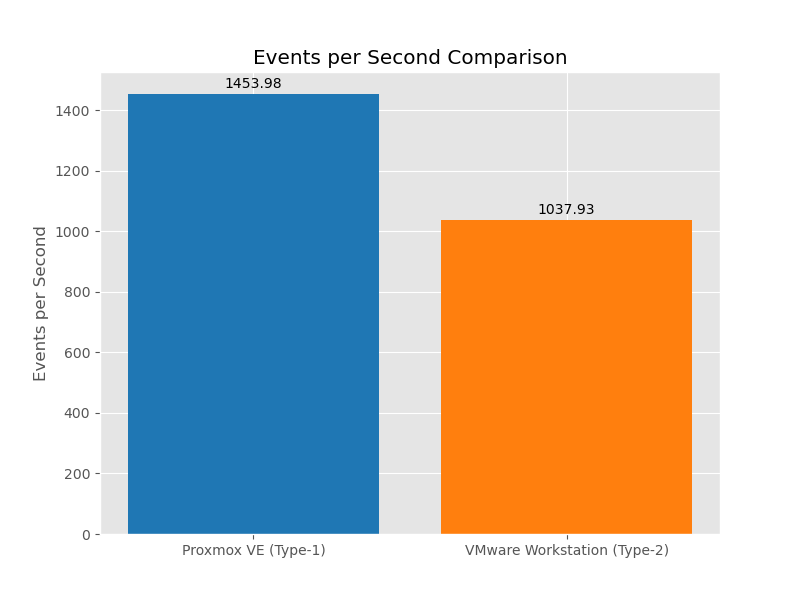

### Total Events and Time per Event
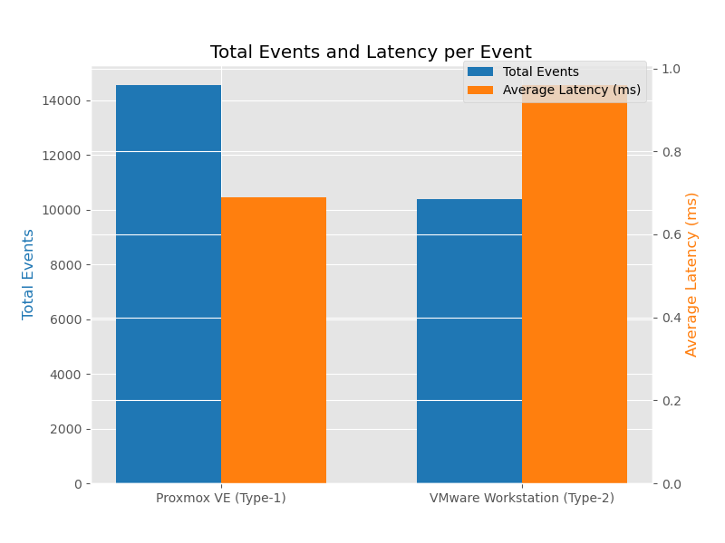

### Average Latency Comparison
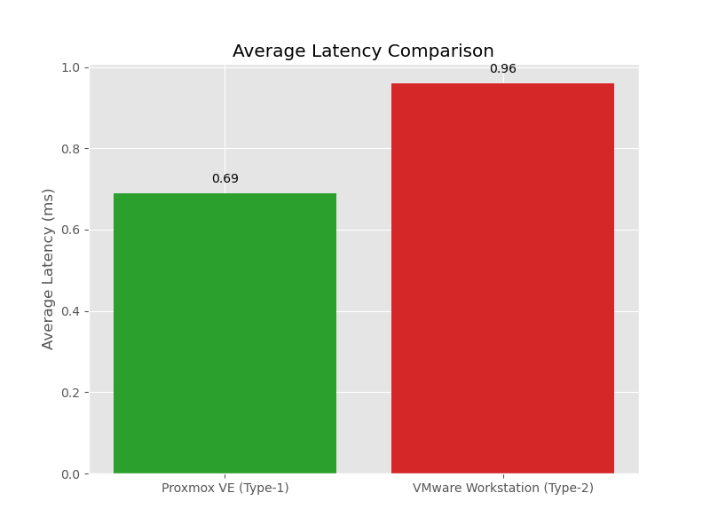

### Latency Consistency
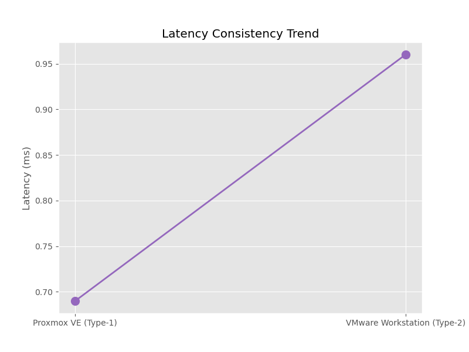

### Relative Performance
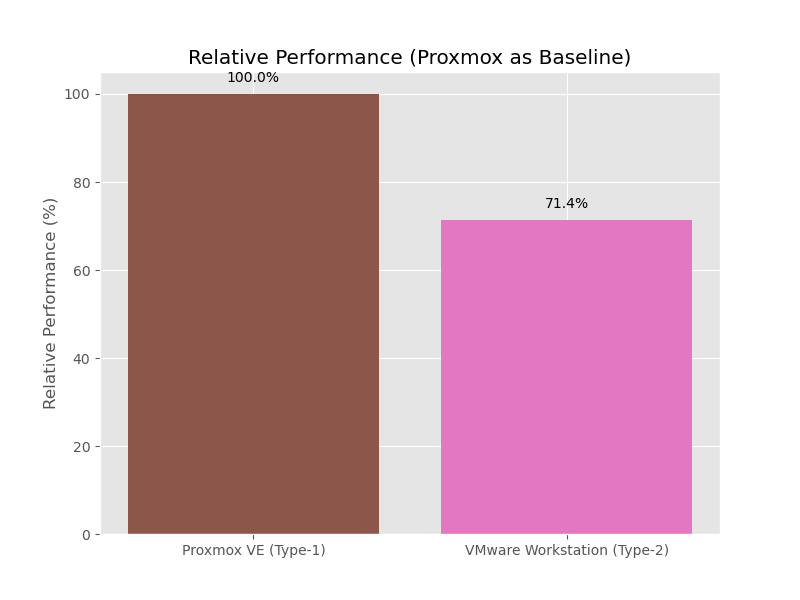

### Type-2 VM Resources
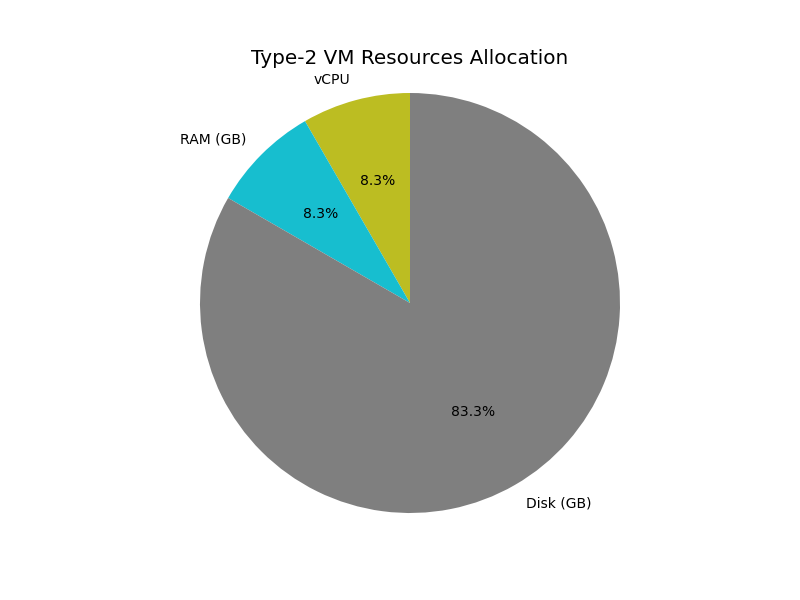

### Performance Summary Dashboard
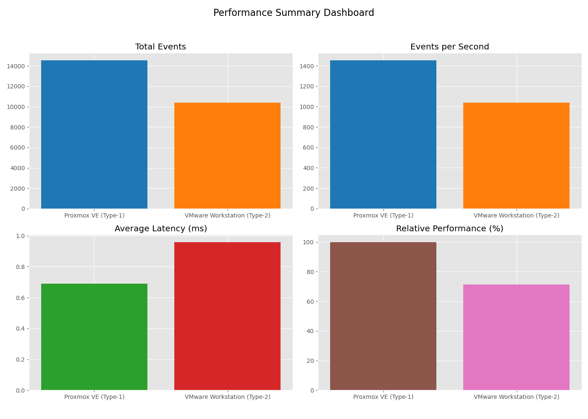

## Performance Analysis

Comparing the recorded values from both hypervisors:
- **Total Execution Time:** Both tests ran for approximately 10 seconds, conforming to Sysbench's default duration limit.
- **Total Events & Events per Second:** Proxmox VE completed a significantly higher number of total events (14,548) compared to VMware Workstation (10,381). This resulted in a higher throughput for Proxmox VE at 1,453.98 events/sec versus 1,037.93 events/sec for VMware.
- **Average Latency:** Proxmox VE recorded a lower average latency of 0.69 ms, indicating faster processing per event, whereas VMware Workstation recorded an average latency of 0.96 ms.

### Comparison Screenshot

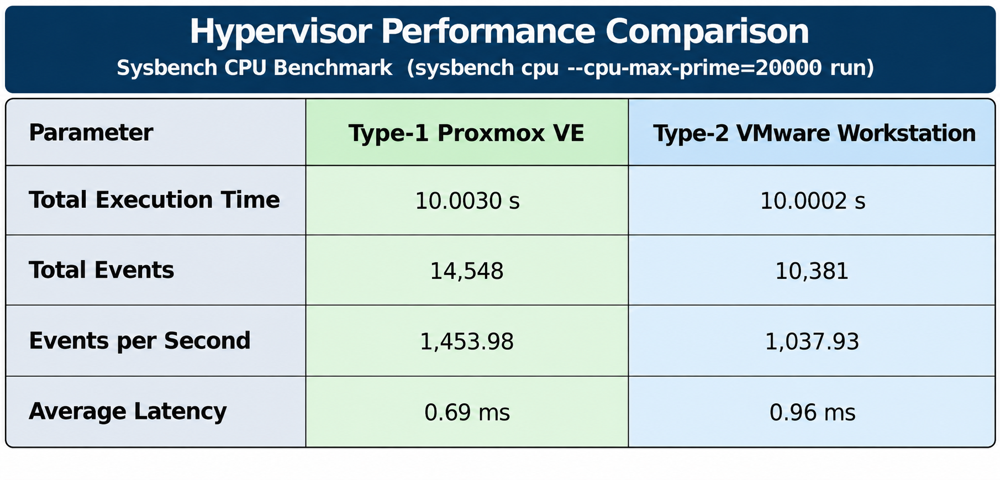

## Observations

- The Type-1 hypervisor (Proxmox VE) exhibited noticeably higher CPU computational throughput during the prime number calculation workload.
- The Type-1 hypervisor demonstrated lower event processing latency, completing instructions more rapidly.
- The Type-2 hypervisor (VMware Workstation), while slightly slower in throughput, successfully completed the identical workload.
- The performance differences highlight the overhead introduced by the Type-2 hypervisor, which must rely on an underlying host operating system to schedule and allocate CPU resources, whereas the Type-1 hypervisor accesses hardware more directly.

## Conclusion

This experiment effectively demonstrated the configuration, execution, and CPU performance profiling of Type-1 and Type-2 hypervisors. Based on the recorded benchmark values, the Type-1 bare-metal architecture (Proxmox VE) yielded higher computational throughput and lower latency than the Type-2 hosted architecture (VMware Workstation) under identically matched virtual machine specifications.

## Repository Structure

```text
Cloud-Computing-Lab/
│
├── README.md
│
└── Exp1/
    │
    ├── README.md
    │
    ├── screenshots/
    │   │
    │   ├── type1-proxmox/
    │   │   ├── 01-proxmox-dashboard.png
    │   │   ├── 02-proxmox-vm-configuration.png
    │   │   ├── 03-proxmox-vm-running.png
    │   │   ├── 04-proxmox-ubuntu-console.png
    │   │   ├── 05-proxmox-system-configuration.png
    │   │   ├── 06-proxmox-sysbench-result.png
    │   │   └── 07-proxmox-resource-monitoring.png
    │   │
    │   ├── type2-vmware/
    │   │   ├── 01-vmware-vm-configuration.png
    │   │   ├── 02-vmware-vm-running.png
    │   │   ├── 03-vmware-system-configuration.png
    │   │   └── 04-vmware-sysbench-result.png
    │   │
    │   └── comparison/
    │       └── 01-hypervisor-performance-comparison.png
    │
    ├── graphs/
    │   ├── 01_hypervisor_architecture.png
    │   ├── 02_events_per_second.png
    │   ├── 03_total_events_and_time_per_event.png
    │   ├── 04_latency_comparison.png
    │   ├── 05_latency_consistency.png
    │   ├── 06_relative_performance.png
    │   ├── 07_type2_vm_resources.png
    │   └── 08_summary_dashboard.png
    │
    └── results/
        └── performance-analysis.md
```

## References

- Cloud Computing Lab Manual
