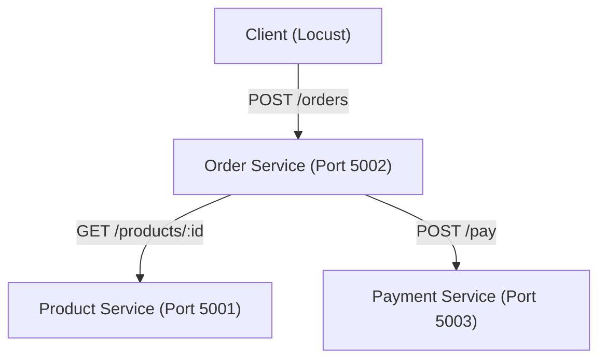
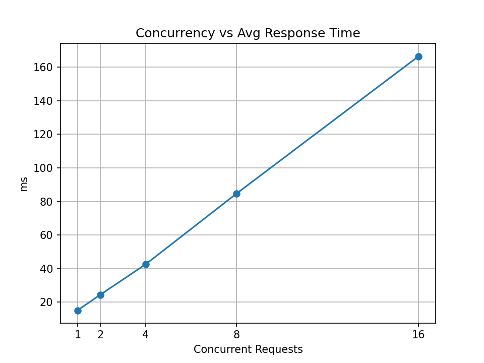
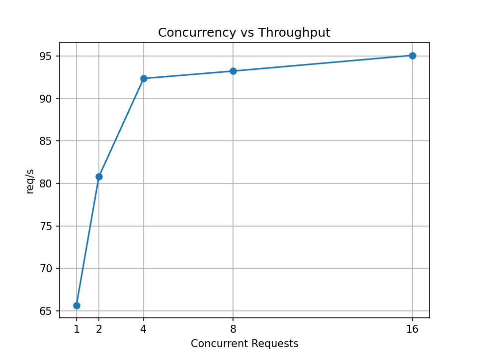
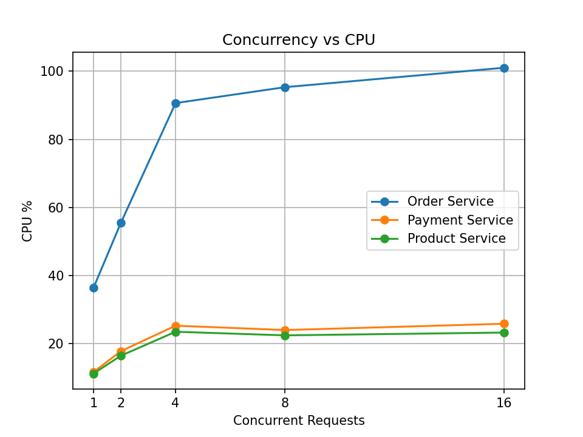
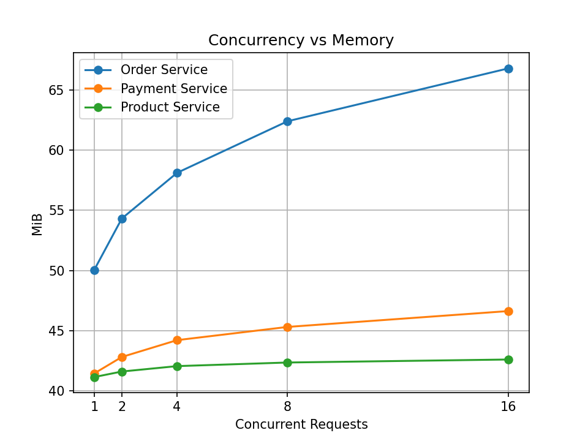

# Cloud Computing Lab Evaluation
## Containerized Microservice Application Under Varying Workloads

### 1. Aim
Develop a microservice-based application containing three independent services, containerize and deploy them using Docker, establish inter-service communication, generate varying workloads, monitor resource utilization, and analyze application performance.

### 2. Application Overview
The application is a simple e-commerce checkout backend consisting of three microservices: Order Service, Product Service, and Payment Service. A client can submit an order containing a product ID and quantity, which is then processed by communicating sequentially with the Product and Payment services to verify item availability/price and then process the payment.

### 3. Microservices
- **Order Service**: Coordinates the overall order creation process. It exposes a `POST /orders` endpoint for creating orders and a `GET /orders` endpoint for retrieving all orders. When a new order is received, it queries the Product Service for the product price and then calls the Payment Service to process the final total.
- **Product Service**: Manages the product catalog. It exposes a `GET /products` endpoint to retrieve all available products and a `GET /products/<product_id>` endpoint to retrieve details for a specific product.
- **Payment Service**: Processes payments. It exposes a `POST /pay` endpoint which accepts an `order_id` and an `amount` and simulates the payment transaction, returning the payment status.

### 4. System Architecture

*Note: Docker Compose places all services on the `app-network` bridge network. Services communicate internally using their Docker service names (e.g., `http://product-service:5001`).*

### 5. Technologies Used
- **Backend Framework**: Python (Flask)
- **Containerization**: Docker, Docker Compose
- **Workload Generation**: Locust
- **Data Visualization**: Matplotlib / Pandas (Python)
- **Monitoring**: Docker Stats

### 6. Project Structure
- `order_service/`: Contains `app.py`, `Dockerfile`, and `requirements.txt` for the Order Service.
- `product_service/`: Contains `app.py`, `Dockerfile`, and `requirements.txt` for the Product Service.
- `payment_service/`: Contains `app.py`, `Dockerfile`, and `requirements.txt` for the Payment Service.
- `docker-compose.yml`: Defines the multi-container application architecture, ports, and networks.
- `locustfile.py`: Contains the testing script that defines Locust user behavior.
- `run_tests.py`: Python script that automates workload testing across concurrency levels.
- `plot.py`: Generates line graphs representing the results.
- `results.csv`: Contains the final recorded results of the workload experiment.
- `results/`: Directory containing intermediate data and summaries produced by Locust.
- `README.md`: This file.

### 7. Microservice Implementation
Each microservice is a lightweight Flask application designed to operate independently.
- The **Order Service** acts as an orchestrator, handling inbound client requests on `5002` and executing `requests.get()` and `requests.post()` calls against sibling services. 
- The **Product Service** provides product details on port `5001`.
- The **Payment Service** processes payment transactions on port `5003`.

### 8. Dockerization
Each service directory contains an identical Dockerfile specifying a lightweight Python base image (`python:3.9-slim` or similar), copying `app.py` and `requirements.txt`, installing the Flask and requests dependencies, and configuring the entrypoint. Three separate Docker images are built dynamically from these files.

### 9. Docker Compose Deployment
The `docker-compose.yml` file is used to deploy all containers simultaneously.
- **Product Service** is mapped to host port `5001`.
- **Order Service** is mapped to host port `5002`.
- **Payment Service** is mapped to host port `5003`.
- The services use a custom bridge network called `app-network`.
- The Order Service specifies a `depends_on` rule ensuring the Product and Payment services start first.

### 10. Inter-Service Communication
The Order Service communicates with its dependencies internally within the Docker bridge network. It does not use localhost; instead, it uses the hostnames defined in Docker Compose:
- `http://product-service:5001/products/<id>`
- `http://payment-service:5003/pay`

### 11. API Endpoint
The central API Endpoint used for workload generation is `POST /orders` hosted on the Order Service at port `5002`.
A typical JSON payload is `{"product_id": 1, "quantity": 2}`.

### 12. Workload Testing
Locust was used to perform automated workload testing against the system. The `locustfile.py` defines a user continually generating `POST /orders` requests without any simulated think-time (`wait_time = constant(0)`). This ensures the application is stressed consistently based on the configured user concurrency. 

### 13. Workload Configuration
The automated test script `run_tests.py` ran Locust in headless mode to simulate five varying workloads.
- **W1**: 1 concurrent user
- **W2**: 2 concurrent users
- **W3**: 4 concurrent users
- **W4**: 8 concurrent users
- **W5**: 16 concurrent users

For each workload, Locust generated traffic for **30 seconds**. A **10-second cooldown** period was provided between workloads to allow the system to stabilize. During each workload, Locust collected response time and throughput metrics while a background thread continually polled `docker stats` to measure average CPU and memory utilization.

### 14. Performance Observation Table

| Workload | Concurrency | Avg Response Time (ms) | P95 (ms) | Throughput (req/s) | Failed | Order CPU (%) | Payment CPU (%) | Product CPU (%) | Order Memory (MiB) | Payment Memory (MiB) | Product Memory (MiB) |
|---|---|---|---|---|---|---|---|---|---|---|---|
| W1 | 1 | 15.06 | 19 | 65.67 | 0 | 36.32 | 11.59 | 11.15 | 50.04 | 41.43 | 41.13 |
| W2 | 2 | 24.39 | 38 | 80.80 | 0 | 55.42 | 17.74 | 16.40 | 54.32 | 42.80 | 41.59 |
| W3 | 4 | 42.56 | 68 | 92.37 | 0 | 90.66 | 25.24 | 23.46 | 58.12 | 44.20 | 42.04 |
| W4 | 8 | 84.76 | 140 | 93.24 | 0 | 95.34 | 23.96 | 22.40 | 62.41 | 45.30 | 42.34 |
| W5 | 16 | 166.54 | 260 | 95.09 | 0 | 101.05 | 25.81 | 23.22 | 66.81 | 46.62 | 42.59 |

### 15. Performance Graphs

**1. Response Time vs Concurrency**

*Observation:* Response time increases from 15.06 ms at 1 user to 166.54 ms at 16 users. The increase becomes much sharper at higher concurrency.

**2. Throughput vs Concurrency**

*Observation:* Throughput increases from 65.67 req/s at 1 user to 92.37 req/s at 4 users, then largely flattens around 93-95 req/s at 8 and 16 users, approaching an observed plateau under the tested configuration.

**3. CPU Utilization vs Concurrency**

*Observation:* Order Service consumes significantly more CPU than the Payment and Product services. Order CPU reaches approximately 101% at 16 concurrent users. (Note: Docker CPU percentages can exceed 100% when expressed relative to a single core in a multi-core environment).

**4. Memory Utilization vs Concurrency**

*Observation:* Order Service memory increases from 50.04 MiB to 66.81 MiB as workload increases, while Payment and Product services remain comparatively stable.

### 16. Performance Analysis
- **Response Time:** As the workload (number of concurrent users) increases, the response time increases significantly. This indicates that the system begins to experience contention as it handles more simultaneous processing threads.
- **Throughput:** Throughput increases initially as more users generate requests but then begins to flatten out after 4 concurrent users. This suggests that the application has reached a performance saturation point under its current deployment constraints. 
- **Resource Utilization (CPU and Memory):** Higher concurrency causes noticeably more CPU consumption. The memory footprint also increases gradually alongside concurrency, particularly for the Order Service.
- **System Stability:** Throughout the entire 30-second workload iterations, no failed requests were observed. The application remained stable even under maximum tested concurrency.

### 17. Bottleneck Identification
Based on both the CPU and Memory performance graphs, the **Order Service is the dominant resource consumer and the main observed bottleneck**. As the orchestrator, it must maintain connections with the client while simultaneously establishing connections with both the Product and Payment services. This overhead makes it the primary source of latency and CPU saturation. 

### 18. Conclusion
The three microservices were successfully containerized and deployed using Docker Compose. Inter-service communication was successfully demonstrated via the Docker bridge network. 

The load tests demonstrated that increasing the workload directly increased response time and CPU utilization. Throughput increased initially but then approached a plateau. Because it acts as an orchestrator, the Order Service consumed the most CPU and memory, making it the main observed bottleneck in the architecture. Overall, the application demonstrated excellent reliability, as no failures occurred during the tested workload levels.

### 19. How to Run
1. **Build and start the services:**
```bash
docker compose up --build -d
```
2. **Verify containers are running:**
```bash
docker compose ps
```
3. **Test the API manually:**
```bash
curl -X POST http://localhost:5002/orders -H "Content-Type: application/json" -d '{"product_id": 1, "quantity": 2}'
```
4. **Run the workload experiment (Optional - generates new results.csv):**
```bash
python run_tests.py
```
5. **Generate graphs from results:**
```bash
python plot.py
```

### 20. Evaluation/Demonstration Steps
1. Show project structure.
2. Show Dockerfiles.
3. Run `docker compose ps`.
4. Show three running containers.
5. Demonstrate one API request using `curl` or Postman.
6. Explain Docker network/service communication within `docker-compose.yml`.
7. Show `locustfile.py` and explain the constant user traffic generation.
8. Show the `results.csv` values generated from the automated test.
9. Show the Observation table in this README.
10. Show the four generated graphs.
11. Explain response time, throughput, CPU and memory trends based on the graphs.
12. Identify the Order Service as the main observed bottleneck.
13. Explain that no failures occurred during the 30-second tests.
